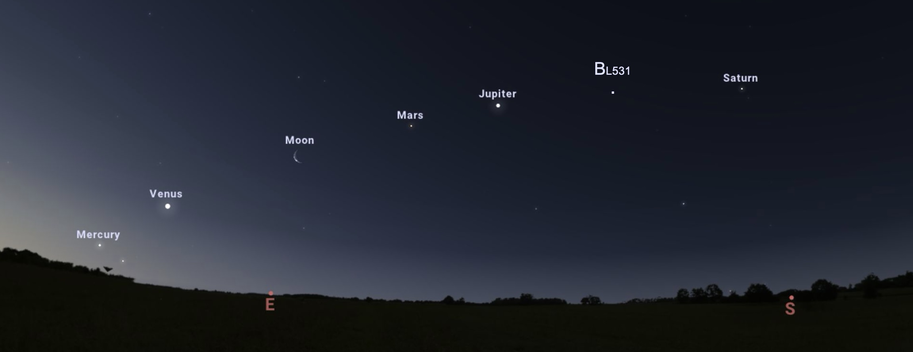

# nabla
khchan@lbl.gov, xchong@lbl.gov, awojdyla@lbl.gov

∇ Next-generation beamline alignment ∇

This repository shares python scripts used for automated beamline alignment at ALS beamline 5.3.1, using [blop](https://github.com/bluesky/blop), a bayesian optimization routine that works with the [bluesky](https://blueskyproject.io/) experiment orchestration and data collection suite

Collaborators:
+ Thomas Morris (https://github.com/bluesky/blop)
+ Thomas Hopkins (NSLS-II)
+ Max Rakitin (NSLS-II)
+ Seij De Leon (ALS)

https://github.com/bluesky/blop

Collaborators:
+ Thomas Morris (https://github.com/bluesky/blop)
+ Thomas Hopkins (NSLS-II)
+ Max Rakitin (NSLS-II)
+ Seij De Leon (ALS)

More infos and resources here: https://dreambeam.lbl.gov/resources/beamline-controls-epicsbluesky

Publications:
"A General Bayesian Algorithm for the Autonomous Alignment of Beamlines"
T.W. Morris, M. Rakitin, Y. Du, M. Fedurin, A.C. Giles, D. Leshchev, W.H. Li, B. Romasky, E. Stavitski, A.L. Walter, P. Moeller, B.  Nash, A. Islegen-Wojdyla
Journal of  Synchrotron Radiation 31 (2024), https://doi.org/10.1107/S1600577524008993